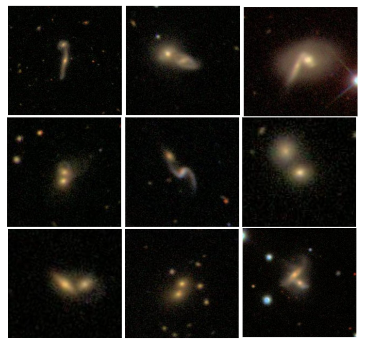

# Identifying Galaxy Mergers with Self Supervised Deep Learning

A galaxy merger in the universe occurs when two or more galaxies collide
with combined mass and material. Galaxy mergers can trigger the formation of
new stars, and studying galaxy mergers is important to understand the evolution
of the universe. With the huge amount of galaxy pictures captured by telescopes,
identifying galaxy mergers becomes the first challenging task to facilitate future
research.

In this research project, an approach based on [self-supervised deep learning](https://github.com/georgestein/ssl-legacysurvey/tree/main) is proposed to identify galaxy mergers from large scientific datasets. Selfsupervised deep learning is an evolving machine learning technique which does
not require human-labeled data, and it has demonstrated remarkable performance in extracting feature representations from data. In order to discover the
characteristics of galaxy mergers in this research project, a [self-supervised deep learning](https://github.com/georgestein/ssl-legacysurvey/tree/main) was used to train a model from the images of galaxy mergers,
and the learned model can be further utilized to extract feature representations
from any galaxy image. The galaxy images which are semantically similar to
known galaxy mergers can be identified by finding similar galaxy images in the
feature representation space.

The dataset used in this research project consists of 61578 galaxy images
from [Galaxy Zoo](https://www.zooniverse.org/projects/zookeeper/galaxy-zoo/) and 3.5 million galaxy images from [Dark Energy Spectroscopic
Instrument (DESI) Legacy Imaging Surveys](https://www.legacysurvey.org/). The comparison with the baseline
method showed significant improvement. A large number of galaxy mergers can
be identified with the proposed method, which can significantly save human
effort to find galaxy mergers.